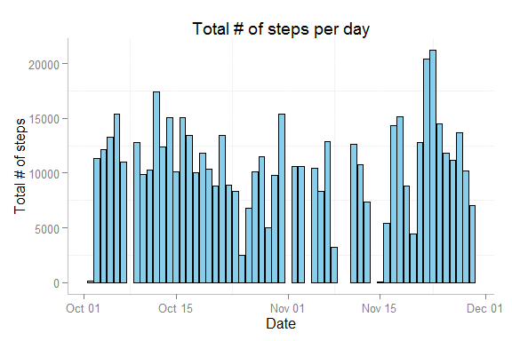

# Reproducible Research: Peer Assessment 1

The data for this assignment (i.e. "activity.csv"" file) must be in the folder "RepData_PeerAssessment1".

The following two libraries will be used during the process:


```r
library(dplyr) # For data manipulation
library(ggplot2) # For data visualization
```

## Loading and preprocessing the data


Considering the dataset, we should assign the following classes to each variable:

- **steps**: This will be a numerical class.
- **date**: This will be a Date class.
- **inteval**: This will be a numerical class.

So, let's create a vector with the classes for each variable


```r
data_types <- c("numeric", "Date", "numeric")
```

Now, we are going to unzip the dataset and load it in our working space (please note that the following code unzips the file and deletes the file once it has been loaded in the WD):


```r
data <- read.csv("activity.csv", colClasses = data_types)
```

After loading the data in our WD, we can easily see that there are 17568 observations in the dataset. But, is the dataset complete? Let's see a summary:


```
##      steps             date               interval     
##  Min.   :  0.00   Min.   :2012-10-01   Min.   :   0.0  
##  1st Qu.:  0.00   1st Qu.:2012-10-16   1st Qu.: 588.8  
##  Median :  0.00   Median :2012-10-31   Median :1177.5  
##  Mean   : 37.38   Mean   :2012-10-31   Mean   :1177.5  
##  3rd Qu.: 12.00   3rd Qu.:2012-11-15   3rd Qu.:1766.2  
##  Max.   :806.00   Max.   :2012-11-30   Max.   :2355.0  
##  NA's   :2304
```

From the summary, we can see that 2304 observations have a NA in the "steps variable. Hence, we need to end up with a dataset with 15264 observations, so let's filter the data.


```r
data <- data[!is.na(data$steps),]
```

Now the clean dataset has 15264 observations.

## What is mean total number of steps taken per day?
We are going to group the dataset in order to report the total number of steps taken per day. Let's create a new variable:


```r
sum_dates <- summarise(group_by(data, date), total_per_day = sum(steps))
```

Let's plot this variable:



## What is the average daily activity pattern?


## Imputing missing values


## Are there differences in activity patterns between weekdays and weekends?
