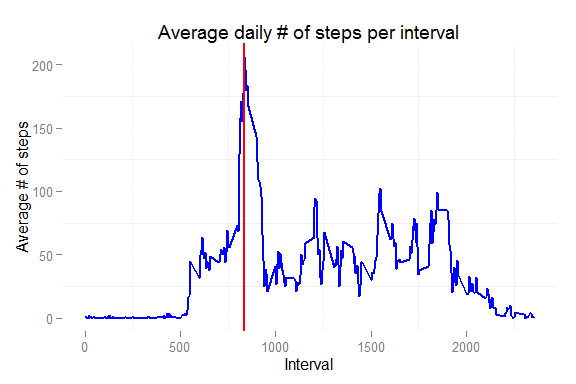

# Reproducible Research: Peer Assessment 1

The data for this assignment (i.e. "activity.csv"" file) must be in the folder "RepData_PeerAssessment1".

The following libraries will be used during the process:


```r
library(dplyr) # For data manipulation
library(ggplot2) # For data visualization
library(gridExtra) # For data visualization 
library(timeDate) # For manipulating dates
```

## Loading and preprocessing the data


Considering the dataset, we should assign the following classes to each variable:

- **steps**: This will be a numerical class.
- **date**: This will be a Date class.
- **inteval**: This will be a numerical class.

So, let's create a vector with the classes for each variable


```r
data_types <- c("numeric", "Date", "numeric")
```

Now, we are going to unzip the dataset and load it as raw data in our working space:


```r
data_file <- unzip("RepData_PeerAssessment1/activity.zip")
```

```
## Warning in unzip("RepData_PeerAssessment1/activity.zip"): error 1 in
## extracting from zip file
```

```r
raw_data <- read.csv("activity.csv", colClasses = data_types)
```

Let's do some exploratory analysis. We can easily see that there are 17568 observations in the dataset. But, is the dataset complete? Let's see a summary:


```
##      steps             date               interval     
##  Min.   :  0.00   Min.   :2012-10-01   Min.   :   0.0  
##  1st Qu.:  0.00   1st Qu.:2012-10-16   1st Qu.: 588.8  
##  Median :  0.00   Median :2012-10-31   Median :1177.5  
##  Mean   : 37.38   Mean   :2012-10-31   Mean   :1177.5  
##  3rd Qu.: 12.00   3rd Qu.:2012-11-15   3rd Qu.:1766.2  
##  Max.   :806.00   Max.   :2012-11-30   Max.   :2355.0  
##  NA's   :2304
```

From the summary, we derive that 2304 observations have a NA in the "steps" variable. Hence, we need to transform the raw data into a dataset with 15264 observations, so let's create the clean dataset.


```r
data <- raw_data[!is.na(raw_data$steps),]
```

Now the clean dataset has 15264 observations.

## What is mean total number of steps taken per day?
We are going to group the dataset in order to report the total number of steps taken per day. Let's create a new variable:


```r
total_steps <- summarise(group_by(data, date), total = sum(steps))
```

Let's plot this variable:


From this summarised data we can obtain the mean (in red) and the median (in green) and plot it over the previous graph. Since the values are so close the lines overlap when plotting over the chart.


```r
mean(total_steps$total)
```

```
## [1] 10766.19
```

```r
median(total_steps$total)
```

```
## [1] 10765
```


## What is the average daily activity pattern?
Similarly as we did for the previous section, we are going to group the dataset in order to report the average number of steps taken per interval. Let's create a new variable:


```r
interval_steps <- summarise(group_by(data, interval), average = mean(steps))
```

Let's plot this variable:


The interval with the highest value would be the interval 835 according to the following function (we plotted below in red):


```r
interval_steps[which(interval_steps$average == max(interval_steps$average)),1]
```




## Imputing missing values
From the analysis made for the first section, we saw that 2304 observations in the raw data have a NA in the "steps"" variable which is the only variable with NA ocurrences. As per the exercise mandate, we need to decide on a strategy to overcome this so we don't end up with a biased dataset.

In my case, I have decided to use the strategy of filling the gaps by using the average # of steps for an interval. Therefore, I'm going to create a different data set where I'm going to assign the average # of steps for an interval to those observations with a NA in the steps variable. This is pretty easy to make using the data that we generate for the previous section.


```r
fill_data <- raw_data

for (i in 1:nrow(fill_data) ) {
        if(is.na(fill_data$steps[i])){
                fill_data$steps[i] = as.numeric(interval_steps[
                        which(interval_steps$interval == fill_data$interval[i]),2])
        }
}
```

We must group the dataset in order to report the total number of steps taken per day. Let's create a new variable:


```r
total_steps_f <- summarise(group_by(fill_data, date), total = sum(steps))
```

Let's plot this variable:


From this summarised data we can obtain the mean (in red) and the median (in green) and plot it over the previous graph like we did in section 2.


```r
mean(total_steps_f$total)
```

```
## [1] 10766.19
```

```r
median(total_steps_f$total)
```

```
## [1] 10766.19
```


From this experiment we can conclude that, although we did not affect the mean at all, the median was impacted in a way that the number is much closer to the mean than before. In fact, with the input of the missing data we have made the mean and the median equal.


## Are there differences in activity patterns between weekdays and weekends?
We need to create a new variable that indicates if the date is a "Weekday" or a "Weekend". Let's do it by using the `isWeekday()` function and attaching the result to the data set that we used before:


```r
fill_data$weekday <- factor(isWeekday(fill_data$date), labels = c("Weekday","Weekend"))
```

In order to report the average # of steps per interval and divided by weekday or weekend, we need to create a new variable that summarises the necessary data.


```r
interval_steps_w <- summarise(group_by(fill_data, interval, weekday), average = mean(steps))
```

Let's plot this variable:


